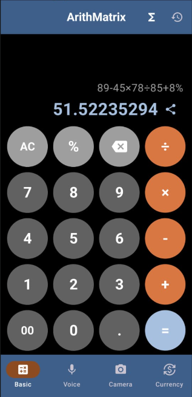
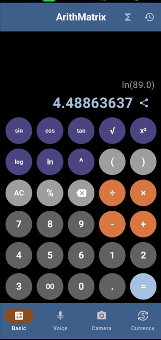
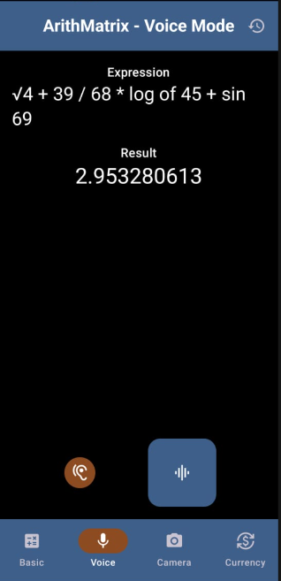
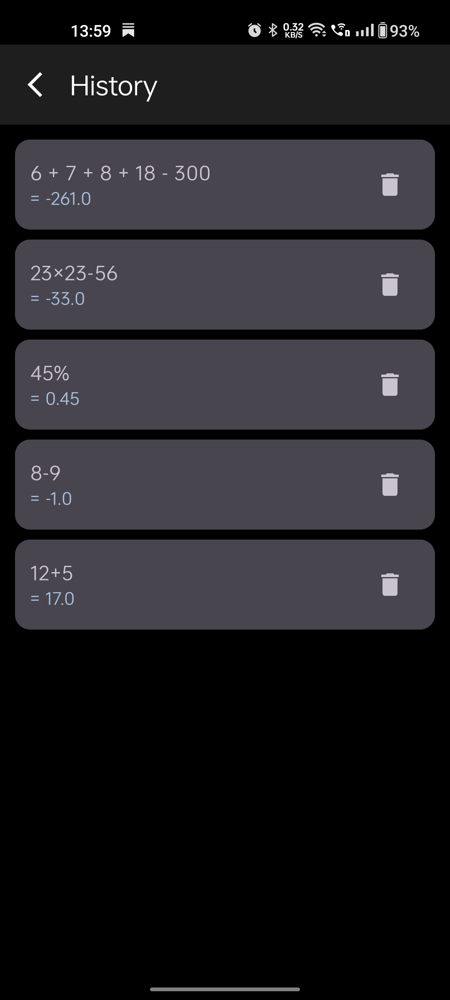
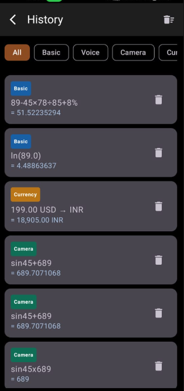

<div align="center">

# 🧮 ArithMatrix
### Multimodal Scientific Calculator — Voice, Camera & Currency


> *Type it. Say it. Point your camera at it.*
> *Four input modes. One expression engine. No compromises.*

</div>

---

## 📸 Screenshots

| Basic | Scientific | Voice | Camera | Currency | History |
|---|---|---|---|---|---|
|  |  |  |  |  |  |

---

## 📌 What is ArithMatrix?

Most calculators are just buttons.

ArithMatrix is a multimodal expression evaluator — give it a math
expression in any form you want and it evaluates it. Typed on a
keypad, spoken out loud, photographed from a page, or converted
between currencies. All four modes share one custom-built expression
engine with full scientific function support.

---

## ✨ Features

### 🧮 Basic Calculator
- Full expression input with proper operator precedence
- Parentheses support — `(5+3)×4`
- Percentage evaluation — `100+10%` → `110`
- Scientific mode toggle — expands to 5×6 grid
- Result chaining — tap `+` after `=` to continue from result
- Share any result via Android ShareSheet
- Haptic feedback on every button

### 🔬 Scientific Mode
- sin, cos, tan (degrees)
- √, x², log (base 10), ln, ^ (power)
- Seamlessly integrated into the same grid — no separate screen
- All scientific results saved to history

### 📷 Camera Calculator
- ML Kit OCR reads printed and typed math expressions from photos
- Handles `sin(45)`, `log 98`, `√16`, `7^2` directly from camera
- OCR noise stripping — `olog98` → `log(98)` automatically
- Editable expression before evaluation

### 🎙 Voice Calculator
- Android SpeechRecognizer with live transcription
- Evaluates scientific phrases — "sine of 45", "log of 100",
  "seven squared", "square root of 16"
- Word-to-number conversion — "twenty five plus five" → `30`
- TTS output — hear the result spoken back
- Works in Hindi and other languages via system STT

### 💱 Currency Converter
- Live exchange rates via Frankfurter API
- 1-hour local cache via DataStore — works offline
- Locale-aware formatting — `1,234,567.89`
- Conversion history saved automatically

### 🗃 Smart History
- Unified history screen across all four modes
- Filter chips — All / Basic / Voice / Camera / Currency
- Source badge on every entry
- Swipe to delete individual entries
- Clear all with confirmation dialog
- Tap any entry to reload the expression into Basic calculator

### 🏠 Home Screen Widget
- Glance-based 4×1 widget
- Shows last calculated expression and result
- Tap to deep-link back into the app

---

## 🏗️ Architecture
UI Layer (Jetpack Compose)
↕ StateFlow / Flow
ViewModel Layer
↕
Repository Layer
↕           ↕           ↕
Room DB    Frankfurter   ML Kit +
(History)  API + Cache   SpeechRecognizer

- **UI** — Compose screens, observe StateFlow, emit events only
- **ViewModel** — all business logic, `@HiltViewModel` throughout
- **Repository** — single source of truth, mediates all data sources
- **Engine** — custom shunting-yard parser handles arithmetic +
  scientific functions as a single expression string

---

## 🛠️ Tech Stack

| Layer | Technology |
|---|---|
| Language | Kotlin |
| UI | Jetpack Compose |
| Architecture | MVVM + Repository Pattern |
| Dependency Injection | Hilt |
| Database | Room (SQLite) with migrations |
| State Management | StateFlow + Flow |
| Concurrency | Kotlin Coroutines |
| Camera + OCR | ML Kit Text Recognition |
| Voice | Android SpeechRecognizer + TTS |
| Currency API | Frankfurter (frankfurter.app) |
| Offline Cache | Jetpack DataStore |
| Widget | Jetpack Glance |
| Expression Engine | Custom shunting-yard + function parser |

---

## 🧠 Expression Engine

ArithMatrix uses a custom-built two-pass expression evaluator:

1. **Sanitize** — normalizes all operator variants, OCR noise,
   function aliases, and symbol forms (`√`, `×`, `÷`, `x²`)
2. **Tokenize** — splits into typed tokens: numbers, operators,
   function names, parentheses
3. **Evaluate** — shunting-yard algorithm with a function
   application stack

Supported expressions:
12 + 5 * 3          → 27
(5+3) × 4           → 32
100 + 10%           → 110
sin(45)             → 0.7071...
cos(90)             → 0
log(100)            → 2
sqrt(16)            → 4
7^3                 → 343
sin(30) + cos(60)   → 1

The same engine is called by all four modes — Basic, Voice,
Camera, and Currency share identical evaluation logic.

---

## 🚀 Getting Started

```bash
git clone https://github.com/ParthCh300X/ArithMatrix.git
```

Open in Android Studio Hedgehog or newer.
No API keys required — Frankfurter API is public.
Camera and microphone permissions requested at runtime with
rationale dialogs.
minSdk    : 26
targetSdk : 34
versionName: 2.0

---

## 🤝 Contributors

**Parth Chaudhary** — Architecture, expression engine, all core logic,
Room + history system, scientific mode, widget, overall system design
→ [github.com/ParthCh300x](https://github.com/ParthCh300x)

**Shravan Bire** — UI refinement, feature contributions,
interaction design, architectural discussions
→ [github.com/shravanBire](https://github.com/shravanBire)

---

<div align="center">
<i>Type it. Say it. Point your camera at it.</i>
</div>
